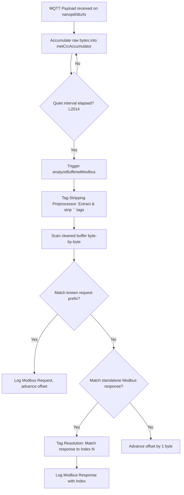

# Internet MQTT Parser Mechanics

This document details the architecture and calculation mechanics of the Internet MQTT log parser implemented in [renderer.js](file:///d:/AI/nanoPD_Pro/frontend/renderer.js). The parser is responsible for extracting, validating, and sequence-aligning Modbus RTU request-response transactions received over MQTT.

---

## 1. Overview of the Pipeline

When the Electron frontend receives binary Modbus payload streams published by the 4G DTU on the topic `nanopd/dtu/tx`, the data flows through the following pipeline:

---

## 2. Step-by-Step Processing Mechanics

### Step 2.1: Accumulation & Delay Triggering
Raw packet fragments are appended to a buffer (`inetCrcAccumulator`). A configurable quiet-period timer (default 10s) restarts with every incoming packet. Analysis is triggered only after the bus goes completely quiet.

### Step 2.2: Tag-Stripping Preprocessor
The 4G DTU is configured to prepend task identifiers `<N>` (where `N` is the 1-based decimal command index, e.g. `<8>` encoded as `3C 38 3E`) to indicate which command is active. 

Before Modbus parsing begins, the preprocessor scans the accumulated buffer:
1. It detects `<N>` byte sequences (`0x3C`, followed by digit characters `0x30-0x39`, followed by `0x3E`).
2. It extracts the integer `N` and records the exact index position in the clean (tag-stripped) buffer where this tag occurred.
3. It removes the tag bytes from the stream.
This results in a clean, tag-stripped Modbus binary buffer, paired with a offset-to-tag lookup map: `tagIndexAtCleanOffset[cleanedOffset] = N`.

---

## 3. Modbus Frame Matching & Tag Resolution

The parser walks through the cleaned buffer byte-by-byte (using `offset`). At each position, it attempts to parse a Modbus frame. When a standalone response frame is matched, it resolves which command index it belongs to using the following priorities:

### Priority 1: Tag-Offset Matching with Lag Correction
The parser looks up the tag offsets recorded during the pre-processing step:
1. **Search inside the frame**: First, check if there is an unconsumed tag located on or inside the response frame boundaries `[offset, offset + respFrame.length]`.
2. **Fallback to before the frame**: If no tag is inside the frame, it finds the closest unconsumed tag before `offset`.

Once a tag `tagN` is found, the parser applies the **Tag Lag Correction Logic**:
- **Why lag occurs**: Since the DTU is polling asynchronously, if a Modbus sensor takes longer to respond than the command interval (e.g. response delay > 1.0s), the DTU's firmware will have already incremented its internal command counter to `expectedIndex + 1` by the time it transmits the response packet over cellular. Consequently, it prepends a shifted tag `<expectedIndex + 1>`.
- **The alignment check**:
  - The parser tracks the next expected command sequence index: `expectedIndex = (lastMatchedIndex % 20) + 1`.
  - **Case A (Lagged Tag)**: If `normalizedTag === expectedIndex + 1`, the tag is confirmed to be lagged. The parser subtracts 1 to realign it: `resolvedIndex = normalizedTag - 1`.
  - **Case B (Skipped Command / No Lag)**: If `normalizedTag !== expectedIndex + 1` (for example, if `expectedIndex = 5` but `normalizedTag = 8` because previous requests timed out), it indicates that some requests failed and the tag is not lagged. The parser trusts the tag directly: `resolvedIndex = normalizedTag`.
  
This resolved index is then matched against the configured polling command list.

### Priority 2: Inline Prefix Sniffing
If no tag is found in the offset map, it searches for text-based fallback tags like `[N]`, `<N>`, or `N:` prepended in the bytes directly preceding `offset`.

### Priority 3: Sequence Tracking
If no tags are found at all, the parser assigns indices sequentially based on the expected sequence orders:
- If all candidate commands have the same expected response length, it maps them round-robin: `matchCount % candidateRules.length`.
- If candidate commands have varying lengths, it compares the response length to the expected response lengths of candidate commands starting from the last matched rule index.

---

## 4. Bus Quiet-Period Postponement

To prevent queries from taking the DTU out of transparent mode and causing physical packet loss on the RS485 bus, we defer signal queries (`query_csq`) via `postponeCellAutoCsqPolling()`.

When any data is received on the DTU connection (`cellSocket`) or Modbus port (`cellModbusSocket`), the CSQ timer is reset from zero. This guarantees that `AT+CSQ` is only sent to the DTU after a quiet period has elapsed with no RS485 or cellular transmission activity.
