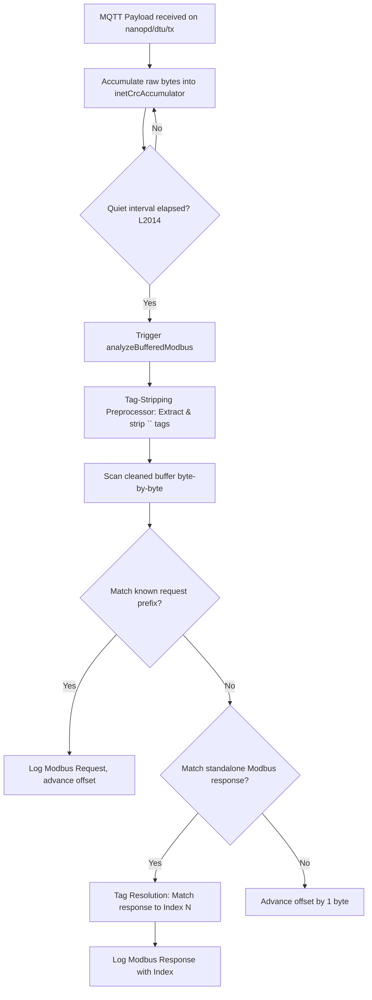

# Internet MQTT Parser Mechanics

This document details the architecture and calculation mechanics of the Internet MQTT log parser implemented in [renderer.js](file:///d:/AI/nanoPD_Pro/frontend/renderer.js). The parser is responsible for extracting, validating, and sequence-aligning Modbus RTU request-response transactions received over MQTT.

---

## 1. Overview of the Pipeline

When the Electron frontend receives binary Modbus payload streams published by the 4G DTU on the topic `nanopd/dtu/tx`, the data flows through the following pipeline:



---

## 2. Step-by-Step Processing Mechanics

### Step 2.1: Accumulation & Delay Triggering
Raw packet fragments are appended to a buffer (`inetCrcAccumulator`). A configurable quiet-period timer (default 10s) restarts with every incoming packet. Analysis is triggered only after the bus goes completely quiet.

### Step 2.2: Tag-Stripping Preprocessor
The 4G DTU is configured to prepend task identifiers `<N>` (where `N` is the 1-based decimal command index, e.g. `<8>` encoded as `3C 38 3E`) to indicate which command is active. 

Before Modbus parsing begins, the preprocessor scans the accumulated buffer:
1. It detects `<N>` byte sequences (`0x3C`, followed by digit characters `0x30-0x39`, followed by `0x3E`).
2. It extracts the integer `N` and records the exact index position in the clean (tag-stripped) buffer where this tag occurred.
3. It removes the tag bytes from the stream.
This results in a clean, tag-stripped Modbus binary buffer, paired with a offset-to-tag lookup map: `tagIndexAtCleanOffset[cleanedOffset] = N`.

---

## 3. Modbus Frame Matching & Tag Resolution

The parser walks through the cleaned buffer byte-by-byte (using `offset`). At each position, it attempts to parse a Modbus frame. When a standalone response frame is matched, it resolves which command index it belongs to using the following priorities:

### Priority 1: Tag-Offset Matching with Lag Correction
The parser looks up the tag offsets recorded during the pre-processing step:
1. **Search inside the frame**: First, check if there is an unconsumed tag located on or inside the response frame boundaries `[offset, offset + respFrame.length]`.
2. **Fallback to before the frame**: If no tag is inside the frame, it finds the closest unconsumed tag before `offset`.

Once a tag `tagN` is found, the parser applies the **Tag Lag Correction Logic**:
- **Why lag occurs**: Since the DTU is polling asynchronously, if a Modbus sensor takes longer to respond than the command interval (e.g. response delay > 1.0s), the DTU's firmware will have already incremented its internal command counter to `expectedIndex + 1` by the time it transmits the response packet over cellular. Consequently, it prepends a shifted tag `<expectedIndex + 1>`.
- **The alignment check**:
  - The parser tracks the next expected command sequence index: `expectedIndex = (lastMatchedIndex % 20) + 1`.
  - **Case A (Lagged Tag)**: If `normalizedTag === expectedIndex + 1`, the tag is confirmed to be lagged. The parser subtracts 1 to realign it: `resolvedIndex = normalizedTag - 1`.
  - **Case B (Skipped Command / No Lag)**: If `normalizedTag !== expectedIndex + 1` (for example, if `expectedIndex = 5` but `normalizedTag = 8` because previous requests timed out), it indicates that some requests failed and the tag is not lagged. The parser trusts the tag directly: `resolvedIndex = normalizedTag`.
  
This resolved index is then matched against the configured polling command list.

### Priority 2: Inline Prefix Sniffing
If no tag is found in the offset map, it searches for text-based fallback tags like `[N]`, `<N>`, or `N:` prepended in the bytes directly preceding `offset`.

### Priority 3: Sequence Tracking
If no tags are found at all, the parser assigns indices sequentially based on the expected sequence orders:
- If all candidate commands have the same expected response length, it maps them round-robin: `matchCount % candidateRules.length`.
- If candidate commands have varying lengths, it compares the response length to the expected response lengths of candidate commands starting from the last matched rule index.

---

## 4. Bus Quiet-Period Postponement

To prevent queries from taking the DTU out of transparent mode and causing physical packet loss on the RS485 bus, we defer signal queries (`query_csq`) via `postponeCellAutoCsqPolling()`.

When any data is received on the DTU connection (`cellSocket`) or Modbus port (`cellModbusSocket`), the CSQ timer is reset from zero. This guarantees that `AT+CSQ` is only sent to the DTU after a quiet period has elapsed with no RS485 or cellular transmission activity.

---

## 5. Guide for Implementing a Custom MQTT Subscriber/Parser

If you wish to write your own MQTT subscriber or parser software to process the incoming DTU telemetry in the same way, you should implement the following processing pipeline:

### 5.1 MQTT Client Connection & Subscription
1. **MQTT Broker Details**: Connect your MQTT client to the broker hosting the DTU traffic.
2. **Topic Subscription**: Subscribe to the default uplink telemetry topic: `nanopd/dtu/tx`.
3. **Payload Protocol**: The 4G DTU transmits serial/RS-485 byte streams natively as binary payloads. Ensure your subscriber handles incoming messages as raw byte arrays, not text strings.

### 5.2 Stream Buffer Accumulation (Reassembly)
Cellular networks often fragment TCP packets. Telemetry streams published over MQTT will arrive in disjoint chunks.
1. Maintain a dynamic queue/buffer (`accumulator`) for incoming bytes.
2. Every time a new payload is received on `nanopd/dtu/tx`, append the raw bytes to the accumulator and restart an **inactivity timer** (quiet period, typically 5 to 10 seconds).
3. Only trigger the parsing routine once the inactivity timer expires. This ensures you process an entire polling round of Modbus frames in sequence. Clear the accumulator after parsing.

### 5.3 Tag-Stripping Preprocessor
When the DTU is configured to output query identifiers, it injects task index tags (e.g. `<N>` where `N` is the 1-based polling command index) into the stream.
1. Scan the accumulated buffer for the ASCII bytes corresponding to `<N>`: `0x3C` (`<`), digit characters `0x30-0x39` representing the index `N`, and `0x3E` (`>`).
2. Record the numeric value of `N` and map it to the exact offset in the *cleaned* stream where the tag was encountered: `tagOffsets[cleanOffset] = N`.
3. Strip these tag bytes completely from the buffer, yielding a standard, clean Modbus RTU binary stream.

### 5.4 Modbus RTU Frame Segmentation
Scan the tag-stripped buffer byte-by-byte using a sliding `offset` to identify valid frames:
1. Identify the Modbus Function Code (FC) at `offset + 1`.
2. Determine the expected frame size:
   - **Error responses** (MSB of FC is set, e.g., `fc & 0x80`): 5 bytes.
   - **Requests (FC 01-06)**: 8 bytes.
   - **Requests (FC 0F, 10)**: Variable, `7 + byteCount + 2` bytes.
   - **Responses (FC 01-04)**: Variable, `3 + byteCount + 2` bytes (where byte count is read from the 3rd byte of the frame).
   - **Responses (FC 05, 06, 0F, 10)**: 8 bytes.
3. Validate the **Modbus CRC-16** (Polynomial: `0xA001`, Initial: `0xFFFF`, stored in Low-Byte, High-Byte order). If the CRC is valid, extract the frame and advance the `offset` by the frame length.

### 5.5 Tag Realignment & Lag Correction
When a standalone response frame is found, map it to its original polling command index using the offsets recorded in Step 5.3:
1. Search for the closest unconsumed tag offset:
   - Check if there is an unconsumed tag located inside the boundaries of the response frame: `[offset, offset + responseFrame.length]`.
   - If not, fall back to the closest unconsumed tag offset appearing *before* the frame.
2. Apply the **Lag Correction Logic**:
   - Track the expected command index in sequence: `expectedIndex = (lastMatchedIndex % 20) + 1`.
   - If `tagIndex === expectedIndex + 1`, the tag is lagged due to asynchronous transmission latency. Realign it by subtracting 1: `resolvedIndex = tagIndex - 1`.
   - If it does not equal `expectedIndex + 1` (e.g. when some commands were skipped or timed out), trust the tag value: `resolvedIndex = tagIndex`.
   - Match the `resolvedIndex` against your command list to extract the corresponding registers.

### 5.6 Python Reference Implementation
Below is a complete, runnable Python script illustrating this architecture:

```python
import time
import paho.mqtt.client as mqtt

# Configuration: List of configured Modbus polling commands
# The parser uses these to match requests and calculate expected response lengths
POLLING_COMMANDS = [
    {"index": 1, "bytes": bytes.fromhex("01 03 00 00 00 02 C4 0B")},
    {"index": 2, "bytes": bytes.fromhex("01 03 00 02 00 02 65 CB")},
    # Add other configured commands here...
]

# Modbus Helper: CRC-16 Calculation
def calculate_modbus_crc(data: bytes) -> bytes:
    crc = 0xFFFF
    for byte in data:
        crc ^= byte
        for _ in range(8):
            if crc & 0x0001:
                crc = (crc >> 1) ^ 0xA001
            else:
                crc = crc >> 1
    return bytes([crc & 0xFF, (crc >> 8) & 0xFF])

# Modbus Helper: Determine Expected Frame Length
def get_modbus_frame_len(data: bytes, offset: int, mode: str) -> int:
    if offset + 2 > len(data):
        return -1  # Need more bytes
    fc = data[offset + 1]
    is_err = (fc & 0x80) != 0
    if is_err:
        return 5  # Error frame is always 5 bytes

    if mode == 'request':
        if 0x01 <= fc <= 0x06:
            return 8
        if fc in (0x0F, 0x10):
            if offset + 7 > len(data):
                return -1
            byte_count = data[offset + 6]
            return 7 + byte_count + 2
    else:  # 'response'
        if 0x01 <= fc <= 0x04:
            if offset + 3 > len(data):
                return -1
            byte_count = data[offset + 2]
            return 3 + byte_count + 2
        if fc in (0x05, 0x06, 0x0F, 0x10):
            return 8
    return 0

# Try Parsing Modbus RTU Frame at Offset
def try_parse_frame(data: bytes, offset: int, mode: str):
    length = get_modbus_frame_len(data, offset, mode)
    if length <= 0 or offset + length > len(data):
        return None
    frame = data[offset:offset+length]
    # Verify CRC
    body, rec_crc = frame[:-2], frame[-2:]
    if calculate_modbus_crc(body) == rec_crc:
        return frame, length
    return None

class TelemetryParser:
    def __init__(self, rules):
        self.rules = rules
        self.rules_by_seq = sorted(rules, key=lambda r: r['index'])
        self.buffer = bytearray()
        self.last_matched_seq_idx = -1

    def append_data(self, data: bytes):
        self.buffer.extend(data)

    def process_buffer(self):
        if not self.buffer:
            return
            
        buf = bytes(self.buffer)
        self.buffer.clear()
        
        # 1. Tag-Stripping Preprocessor
        cleaned = bytearray()
        tag_offsets = {}  # cleanedOffset -> tagIndex (int)
        
        i = 0
        while i < len(buf):
            # Look for '<N>' (0x3C, ASCII digits, 0x3E)
            if buf[i] == 0x3C:
                j = i + 1
                while j < len(buf) and ord('0') <= buf[j] <= ord('9'):
                    j += 1
                if j > i + 1 and j < len(buf) and buf[j] == 0x3E:
                    tag_val = int(buf[i+1:j].decode('ascii', errors='ignore'))
                    tag_offsets[len(cleaned)] = tag_val
                    i = j + 1
                    continue
            cleaned.append(buf[i])
            i += 1
            
        cleaned_bytes = bytes(cleaned)
        tag_keys = sorted(tag_offsets.keys())
        consumed_tags = set()
        
        # 2. Sequential Frame Parsing
        offset = 0
        while offset < len(cleaned_bytes):
            # Try to match known request rules
            matched_rule = None
            for rule in self.rules:
                prefix = rule['bytes'][:-2]
                if cleaned_bytes[offset:].startswith(prefix):
                    matched_rule = rule
                    break
                    
            if matched_rule:
                req_len = len(matched_rule['bytes'])
                if offset + req_len <= len(cleaned_bytes):
                    req_frame = cleaned_bytes[offset:offset+req_len]
                    print(f"[Parsed Request] Command Index: {matched_rule['index']} | Data: {req_frame.hex(' ').upper()}")
                    
                    if matched_rule in self.rules_by_seq:
                        self.last_matched_seq_idx = self.rules_by_seq.index(matched_rule)
                        
                    # Peek for an immediate response following the request
                    resp_offset = offset + req_len
                    parsed_resp = try_parse_frame(cleaned_bytes, resp_offset, 'response')
                    if parsed_resp:
                        resp_frame, resp_len = parsed_resp
                        print(f"[Parsed Response] Command Index: {matched_rule['index']} | Data: {resp_frame.hex(' ').upper()}")
                        offset += req_len + resp_len
                        continue
                    else:
                        offset += req_len
                        continue

            # Try parsing a standalone response (e.g. if request wasn't transmitted over MQTT)
            parsed_resp = try_parse_frame(cleaned_bytes, offset, 'response')
            if parsed_resp:
                resp_frame, resp_len = parsed_resp
                
                # Tag resolution & Lag correction
                expected_idx = 1
                if self.last_matched_seq_idx != -1:
                    last_rule = self.rules_by_seq[self.last_matched_seq_idx]
                    expected_idx = (last_rule['index'] % 20) + 1
                    
                # Search for unconsumed tag inside or before the response frame
                best_tag_offset = -1
                for to in tag_keys:
                    if offset <= to < offset + resp_len and to not in consumed_tags:
                        best_tag_offset = to
                        break
                if best_tag_offset == -1:
                    for to in tag_keys:
                        if to < offset and to not in consumed_tags:
                            best_tag_offset = to
                        elif to >= offset:
                            break
                            
                resolved_index = None
                if best_tag_offset != -1:
                    # Mark tag as consumed
                    for to in tag_keys:
                        if to <= best_tag_offset:
                            consumed_tags.add(to)
                    tag_val = tag_offsets[best_tag_offset]
                    
                    # Normalize tag for wrap-around math
                    normalized_tag = tag_val
                    if expected_idx > 15 and tag_val < 5:
                        normalized_tag = tag_val + 20
                    
                    # Apply Lag Correction: If tag is expectedIndex + 1, subtract 1
                    resolved_index = normalized_tag
                    if normalized_tag == expected_idx + 1:
                        resolved_index = normalized_tag - 1
                    if resolved_index > 20:
                        resolved_index -= 20
                        
                    print(f"[Parsed Standalone Response] Resolved Index: {resolved_index} (Raw Tag: {tag_val}) | Data: {resp_frame.hex(' ').upper()}")
                    
                    # Update sequence tracking
                    chosen_rule = next((r for r in self.rules_by_seq if r['index'] == resolved_index), None)
                    if chosen_rule:
                        self.last_matched_seq_idx = self.rules_by_seq.index(chosen_rule)
                else:
                    # Fallback to pure sequence matching if no tag exists
                    print(f"[Parsed Standalone Response] No Tag Found | Data: {resp_frame.hex(' ').upper()}")
                
                offset += resp_len
                continue

            offset += 1

# Setup MQTT Callback functions (Concept)
parser = TelemetryParser(POLLING_COMMANDS)
last_recv_time = time.time()

def on_message(client, userdata, msg):
    global last_recv_time
    # msg.payload contains the raw bytes from the topic
    parser.append_data(msg.payload)
    last_recv_time = time.time()

# Background checking loop
# In your application, call process_buffer after 10s of silence:
# while True:
#     if time.time() - last_recv_time > 10.0:
#         parser.process_buffer()
#     time.sleep(1.0)
```
